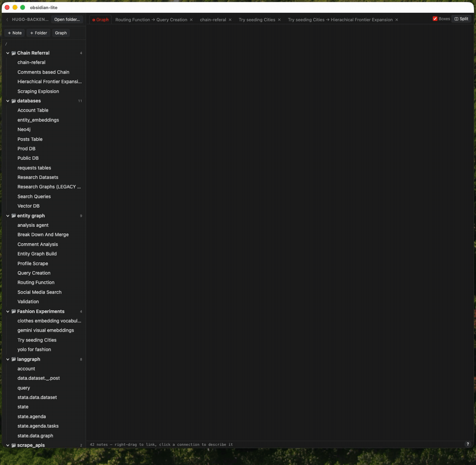

# bedrock

A markdown vault whose graph is the place you actually work, not a picture of it.

## Demo



## Installation

macOS, and a `bedrock` command you can run from anywhere:

```bash
git clone https://github.com/Novelty-Labs-Stuhi/bedrock.git
cd bedrock
npm install
npm install -g .
```

`npm install` fetches the dependencies and builds the app. `npm install -g .` puts
`bedrock` on your `PATH` — it links this checkout rather than copying it, so leave
the clone where it is, and after a `git pull` the next `bedrock` rebuilds whatever
changed.

## Usage

```bash
bedrock
```

From any directory. The window opens detached, so the terminal stays free and
closing it does not take the app down with it.

- `bedrock` — start it, building first if the sources moved on
- `bedrock stop` — quit the app (⌘Q in the window does the same)
- `bedrock restart` — stop, then start
- `bedrock status` — whether it is running
- `bedrock build` — build once, with the output shown
- `bedrock dev` — vite dev server on `:5183`, for working on the app itself

## Math

⌘E writes a formula. It opens a MathLive field where the caret is, with the symbol
and template bar above the note and the LaTeX beside it — type into either one and
the other follows. Enter or Escape puts the caret back in the text; so does an arrow
key with nowhere left to go inside the formula. Clicking a formula reopens it.

Formulas are stored as plain LaTeX in the markdown — `$E = mc^2$` inline, `$$…$$`
for one on its own — so a note with math in it is still a note: greppable, diffable,
and readable in any other editor. A `$` that reads like money is left alone (`$5 and
$10 each` is not a formula), and putting the caret in the block shows the LaTeX as
ordinary characters, which is still the way to fix it by hand.

MathLive loads on demand, and its fonts ship with the app rather than coming from a
CDN, so math works offline.

## Features

Toggle in Settings:

- **Stickies** — loose text pinned to the canvas
- **Todos** — checklist stickies that can point an arrow at a note
- **Git** — a commit button that snapshots the vault (desktop app)
- **Gemini** — conversation notes: rectangles that open the chat in the browser
